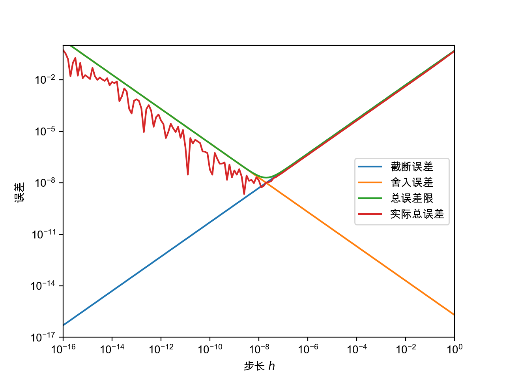

## 第一章：数值计算导论

<center><span>计 93 王哲凡 2019011200</span></center>

### 上机题 1

#### 题目描述

> 1. 编程实现例 1. 4 , 绘出图 1 - 2 , 体会两种误差对结果的不同影响. 

#### 实验代码

见 `Chapter1/1.py`。

其中 `trunc()`、`round()`、`total()`、`actual()` 分别实现了截断误差、舍入误差、总误差限、实际总误差：

```python
def trunc(h):
    return M * h / 2

def round(h):
    return epsilon * 2 / h

def total(h):
    return trunc(h) + round(h)

def actual(h):
    return np.abs(np.cos(1) - (np.sin(1 + h) - np.sin(1)) / h)
```

#### 实验结果

画图得：



#### 实验结论

图像与例 1.4 图像基本吻合（考虑到步长不同，实际总误差不完全一样）。

可以看出，在 $h = h_0 = 10^{-8}$ 时，实际总误差基本达到最小值，而距离 $h_0$ 越远，则误差也就越大。

可见例 1.4 给出的误差估计方法较为准确，实际中使用差商法时，我们也可以类似估计误差最小的步长值，以得到更精确的结果。

### 上机题 3

#### 题目描述

> 3. 编程观察无穷级数：
>    $$
>    \sum_{n = 1}^\infty \frac1n
>    $$
>    的求和计算.
>
>    1. 采用 IEEE 单精度浮点数，观察当 $n$ 为何值时，求和结果不再变化，将它与理论分析的结论进行比较（注：在MATLAB 中可用 single 命令将变量转成单精度浮点数）。
>    2. 用 IEEE 双精度浮点数计算 1 中前 $n$ 项的和，评估 IEEE 单精度浮点数计算结果的误差。
>    3. 如果采用 IEEE 双精度浮点数，估计当 $n$ 为何值时求和结果不再变化，这在当前做实验的计算机上大概需要多长的计算时间？

#### 实验过程

代码主体见 `Chapter1/3.py`。

##### 第 1 问

其中 `n_f32()` 函数计算了，使用单精度浮点数时，$n$ 为何值时，求和结果不再变化：

```python
def n_f32():
    n = 1
    sum = np.float32(0)
    new_sum = np.float32(1 + sum)
    while new_sum != sum:
        n += 1
        sum, new_sum = new_sum, np.float32(new_sum + np.float32(1 / n))

    print(f'Stop at n = {n}, sum = {sum}')
    return n
```

运行可得到输出：

```
Stop at n = 2097152, sum = 15.403682708740234
```

即 $n = 2097152$。

`n_f32_theory()` 函数计算了理论上的 $n$ 值，即满足：
$$
\frac1n \le \frac12 \varepsilon_{\rm match} \sum_{i = 1}^{n - 1} \frac{1}{i}
$$
的最小 $n$，运行后得到：

```
Theory: stop at n = 2195967
```

即 $n = 2195967$。

可以看到理论值略大于实际值，这是机器精度的估计本身带有误差，且计算过程还同时有截断误差导致的。

##### 第 2 问

函数 `n_f32_error()` 使用双精度浮点数计算了 `n_f32()` 计算的误差：

```python
def n_f32_error(limit):
    n = 1
    sum_32 = np.float32(0)
    sum_64 = np.float64(0)
    while n <= limit:
        sum_32 = np.float32(sum_32 + np.float32(1 / n))
        sum_64 = np.float64(sum_64 + np.float64(1 / n))
        n += 1

    err = np.abs(sum_64 - sum_32)
    rel_err = err / sum_64

    print(f'Absolute error = {err:.4f}, relative error = {rel_err:.4%}')
```

运行可得到输出：

```
Absolute error = 0.2704, relative error = 1.7866%
```

##### 第 3 问

对于双精度浮点数运算停止 $n$ 的估计，采用调和级数的近似表示：
$$
\sum_{i = 1}^n \frac1i \approx \ln n + \gamma + \frac1{2n}
$$
其中 $\gamma$ 为欧拉常数。

我们借由此计算新的不等式：
$$
\frac1n \le \frac12 \varepsilon_{\rm match} \left(\ln n + \gamma + \frac1{2n}\right)
$$
函数 `n_f64_estimation()` 对此不等式作出了估计，得到：

```
578556828663210.0
```

经过测试，我的电脑运算 $n = 10000000$ 时的双精度浮点数运算，大约需要 $5s$，因此可估计所需时间为：
$$
\frac{n}{10000000} \times 5 s \approx 3348 \, \mathrm{days}
$$
当然这个速度很大原因是由于 Python 本身的由于对面向对象等抽象特性支持的开销（比如对于 `numpy.float64` 的转化和支持），以及机器性能本身较差，实际使用 C 语言以及更强的算力，应该可以在较快的时间内完成。

#### 实验结论

本实验中，我深刻观察到了浮点数运算中大数吃小数的现象。

这一方面是机器精度不够的原因，另一方面也是计算方法所带来的一些局限性。

