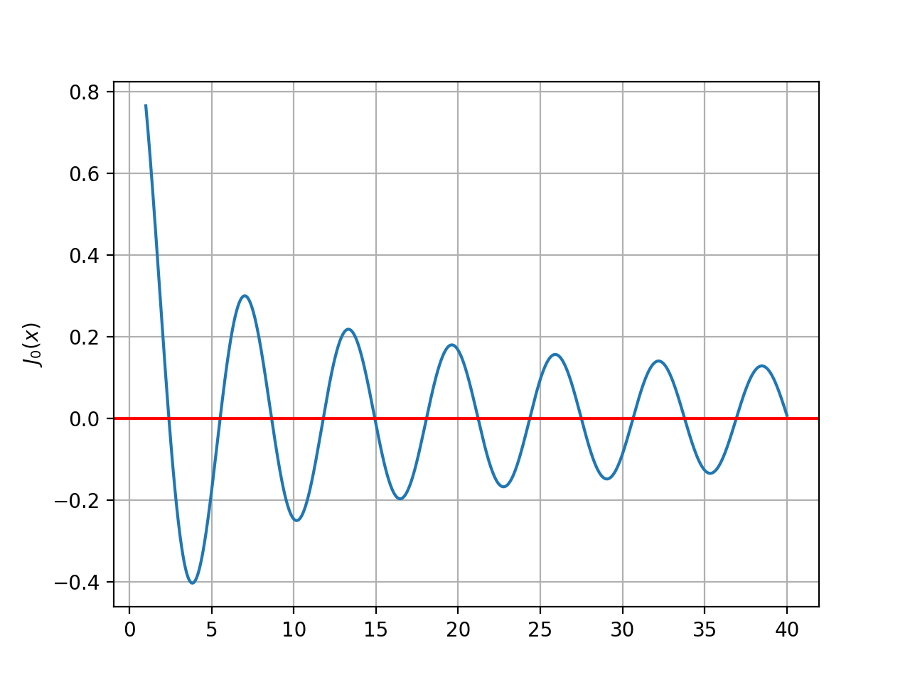
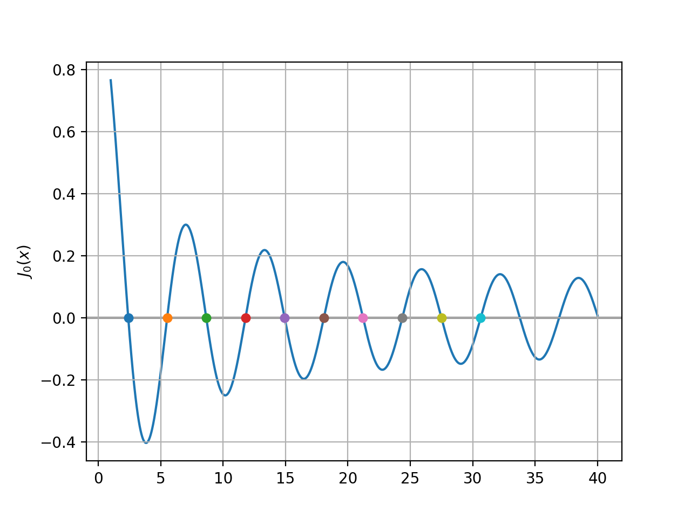

## 第二章：非线性方程求根

<center><span>计 93 王哲凡 2019011200</span></center>

### 上机题 2

#### 题目描述

> 2. 编程实现牛顿法与牛顿下山法求解下面两个方程，要求：
>
>    1. 设定合适的迭代判停准则；
>    2. 设置合适的下山因子序列；
>    3. 打印每个迭代步的近似解及值
>    4. 请用其他方法（如 `fzero` 函数）验证结果正确性。
>
>    最终总结哪个问题需要用牛顿下山法求解，及采用牛顿下山法后的效果：
>
>    1. $x^3 - 2x + 2 = 0$，取 $x_0 = 0$。
>    2. $-x^3 + 5x = 0$，取 $x_0 = 1.35$。

#### 实验过程

代码见 `Chapter2/2.py`。

##### 基本实现

首先实现了两种牛顿法的函数 `Newton()`：

```python
def Newton(f, fprime, x0, damp=False):
    epsilon = 1e-10
    iter = 0
    x = last = x0
    print(f'Initial state: x0 = {x}, f(x0) = {f(x)}')
    while np.abs(x - last) > epsilon or np.abs(f(x)) > epsilon:
        if iter >= 100:
            print('Can not converge!')
            return None
        last, x = x, x - f(x) / fprime(x)
        iter += 1
        print(f'Iteration {iter}: x = {x:.10f}, f(x) = {f(x):.10f}')
        if damp:
            lamb = 0.9
            i = 0
            while np.abs(f(x)) > np.abs(f(last)):
                x = last - lamb * f(last) / fprime(last)
                lamb /= 2
                i += 1
                print(f'Damping iteration {i}: x = {x:.10f}, f(x) = {f(x):.10f}')
    return x
```

为了实现简便，超过 $100$ 轮被视为无法收敛（后续会看到确实发散）。

其中利用 `damp` 变量控制是否采用牛顿下山法，设置阻尼系数初始值为 $\lambda_0 = 0.9$，后续每次折半。

##### 第 1 问

首先对 $x^3 - 2x + 2 = 0, x_0 = 0$ 利用牛顿法求解：

```
Initial state: x0 = 0, f(x0) = 2
Iteration 1: x = 1.0000000000, f(x) = 1.0000000000
Iteration 2: x = 0.0000000000, f(x) = 2.0000000000
Iteration 3: x = 1.0000000000, f(x) = 1.0000000000
Iteration 4: x = 0.0000000000, f(x) = 2.0000000000
...
Iteration 99: x = 1.0000000000, f(x) = 1.0000000000
Iteration 100: x = 0.0000000000, f(x) = 2.0000000000
Can not converge!
```

可以看到 $x$ 会在 $0, 1$ 之间来回跳跃，无法收敛，这也是因为函数设计上使得牛顿法陷入了循环。

再使用牛顿下山法求解：

```
Initial state: x0 = 0, f(x0) = 2
Iteration 1: x = 1.0000000000, f(x) = 1.0000000000
Iteration 2: x = 0.0000000000, f(x) = 2.0000000000
Damping iteration 1: x = 0.1000000000, f(x) = 1.8010000000
Damping iteration 2: x = 0.5500000000, f(x) = 1.0663750000
Damping iteration 3: x = 0.7750000000, f(x) = 0.9154843750
Iteration 3: x = 5.3957413249, f(x) = 148.3002621853
Damping iteration 1: x = 4.9336671924, f(x) = 112.2234138006
...
Damping iteration 7: x = 0.8399791749, f(x) = 0.9127015687
Iteration 4: x = -6.9812748181, f(x) = -324.2922053433
Damping iteration 1: x = -6.1991494188, f(x) = -223.8316255972
...
Damping iteration 9: x = 0.8124825788, f(x) = 0.9113772941
Iteration 5: x = 47.2729767181, f(x) = 105549.9978956384
Damping iteration 1: x = 42.6269273042, f(x) = 77372.2146138892
...
Damping iteration 14: x = 0.8175868811, f(x) = 0.9113408052
Iteration 6: x = -169.6882408273, f(x) = -4885678.6417734977
Damping iteration 1: x = -152.6376580565, f(x) = -3555883.7523255027
...
Damping iteration 18: x = 0.8164161105, f(x) = 0.9113379080
Iteration 7: x = 2312.6636149141, f(x) = 12369075509.4720153809
Damping iteration 1: x = 2081.4788950338, f(x) = 9018116364.3932819366
...
Damping iteration 25: x = 0.8165401277, f(x) = 0.9113378967
Iteration 8: x = -4270.9388039710, f(x) = -77905837103.8473663330
Damping iteration 1: x = -3843.7632695611, f(x) = -56789734515.2088165283
...
Damping iteration 27: x = 0.8164828390, f(x) = 0.9113378926
Iteration 9: x = 13538.0316835972, f(x) = 2481227430504.8481445312
Damping iteration 1: x = 12184.3101635214, f(x) = 1808851155844.0236816406
...
Damping iteration 30: x = 0.8165055325, f(x) = 0.9113378923
Iteration 10: x = -20780.4298836804, f(x) = -8973535404110.3007812500
Damping iteration 1: x = -18702.3052447591, f(x) = -6541621623849.0781250000
...
Damping iteration 31: x = 0.8164881139, f(x) = 0.9113378923
Iteration 11: x = 21971.5012530056, f(x) = 10606673356063.3652343750
Damping iteration 1: x = 19774.4327765164, f(x) = 7732360649622.0400390625
...
Damping iteration 32: x = 0.8164973217, f(x) = 0.9113378921
Iteration 12: x = -251130.7995743885, f(x) = -15837985396415746.0000000000
Damping iteration 1: x = -226017.6379672175, f(x) = -11545878840918612.0000000000
...
Damping iteration 39: x = 0.8164964994, f(x) = 0.9113378921
Iteration 13: x = 2282546.3270821963, f(x) = 11892106845683740672.0000000000
Damping iteration 1: x = 2054291.7760236268, f(x) = 8669346924215291904.0000000000
...
Damping iteration 45: x = 0.8164966162, f(x) = 0.9113378921
Iteration 14: x = -5273814.4566514688, f(x) = -146681228661654454272.0000000000
Damping iteration 1: x = -4746432.9293366605, f(x) = -106930610175980257280.0000000000
...
Damping iteration 47: x = 0.8164965488, f(x) = 0.9113378921
Iteration 15: x = 5781274.0205845870, f(x) = 193228269114997997568.0000000000
Damping iteration 1: x = 5203146.7001757836, f(x) = 140863414816270057472.0000000000
...
Damping iteration 48: x = 0.8164965857, f(x) = 0.9113378921
Iteration 16: x = -38810236.7251516581, f(x) = -58457316525228643319808.0000000000
Damping iteration 1: x = -34929212.9709868282, f(x) = -42615383448041669263360.0000000000
...
Damping iteration 53: x = 0.8164965780, f(x) = 0.9113378921
Iteration 17: x = 62791026.6060771942, f(x) = 247566998279918599536640.0000000000
Damping iteration 1: x = 56511924.0271191299, f(x) = 180476342528329067266048.0000000000
...
Damping iteration 54: x = 0.8164965842, f(x) = 0.9113378921
Iteration 18: x = -56176416.9804341570, f(x) = -177280965098307032449024.0000000000
Damping iteration 1: x = -50558775.2007410824, f(x) = -129237822930529753759744.0000000000
...
Damping iteration 53: x = 0.8164965730, f(x) = 0.9113378921
Iteration 19: x = 23503449.1348456889, f(x) = 12983590192902031015936.0000000000
Damping iteration 1: x = 21153104.3030107766, f(x) = 9465037360228923867136.0000000000
...
Damping iteration 52: x = 0.8164965824, f(x) = 0.9113378921
Iteration 20: x = -125776282.6067370325, f(x) = -1989739695497168004579328.0000000000
Damping iteration 1: x = -113198654.2644136697, f(x) = -1450520234878675032473600.0000000000
...
Damping iteration 55: x = 0.8164965761, f(x) = 0.9113378921
Iteration 21: x = 38717003.1831337735, f(x) = 58037033062424828182528.0000000000
Damping iteration 1: x = 34845302.9464700520, f(x) = 42308997399923528826880.0000000000
...
Damping iteration 53: x = 0.8164965839, f(x) = 0.9113378921
Iteration 22: x = -63437143.0133675262, f(x) = -255288262164251880194048.0000000000
Damping iteration 1: x = -57093428.6303811073, f(x) = -186105142319289271844864.0000000000
...
Damping iteration 54: x = 0.8164965775, f(x) = 0.9113378921
Iteration 23: x = 54614009.7681966648, f(x) = 162896664234037631516672.0000000000
Damping iteration 1: x = 49152608.8730266541, f(x) = 118751668818404960108544.0000000000
...
Damping iteration 53: x = 0.8164965884, f(x) = 0.9113378921
Iteration 24: x = -24777459.9404220507, f(x) = -15211440673058772221952.0000000000
Damping iteration 1: x = -22299713.8647301868, f(x) = -11089140128852287160320.0000000000
...
Damping iteration 24: x = -1.8418365559, f(x) = -0.5645030440
Iteration 25: x = -1.7728018087, f(x) = -0.0260044481
Iteration 26: x = -1.7693011662, f(x) = -0.0000651315
Iteration 27: x = -1.7692923543, f(x) = -0.0000000004
Iteration 28: x = -1.7692923542, f(x) = 0.0000000000
```

可以看到虽然迭代轮数依然很多，但是最终能够收敛。

与 `scipy.optimize.root` 的结果比较：

```
Damping Newton method final x = -1.7692923542386314
scipy final x = -1.7692923542386312
```

发现误差也基本很小（这源于我们控制的 `epsilon`）。

因此这个方程的解需要使用牛顿下山法求解，但也存在收敛较慢的问题，这是因为初始值选定位置会使得迭代法优先往右函数右侧考虑，而右侧却恰好存在一个极小值点干扰计算。

##### 第 2 问

再对 $-x^3 + 5x = 0, x_0 = 1.35$ 利用牛顿法求解：

```
Initial state: x0 = 1.35, f(x0) = 4.289624999999999
Iteration 1: x = 10.5256684492, f(x) = -1113.5072686208
Iteration 2: x = 7.1242866256, f(x) = -325.9750111810
Iteration 3: x = 4.9107806530, f(x) = -93.8733368953
Iteration 4: x = 3.5169113059, f(x) = -25.9149417174
Iteration 5: x = 2.7097430062, f(x) = -6.3481343414
Iteration 6: x = 2.3369400315, f(x) = -1.0780040541
Iteration 7: x = 2.2422442540, f(x) = -0.0620188943
Iteration 8: x = 2.2360934030, f(x) = -0.0002542596
Iteration 9: x = 2.2360679779, f(x) = -0.0000000043
Iteration 10: x = 2.2360679775, f(x) = -0.0000000000
Iteration 11: x = 2.2360679775, f(x) = -0.0000000000
```

再使用牛顿下山法求解：

```
Initial state: x0 = 1.35, f(x0) = 4.289624999999999
Iteration 1: x = 10.5256684492, f(x) = -1113.5072686208
Damping iteration 1: x = 9.6081016043, f(x) = -838.9373143777
Damping iteration 2: x = 5.4790508021, f(x) = -137.0858384262
Damping iteration 3: x = 3.4145254011, f(x) = -22.7372690386
Damping iteration 4: x = 2.3822627005, f(x) = -1.6084455871
Iteration 2: x = 2.2485100904, f(x) = -0.1254615268
Iteration 3: x = 2.2361704938, f(x) = -0.0010252336
Iteration 4: x = 2.2360679845, f(x) = -0.0000000705
Iteration 5: x = 2.2360679775, f(x) = -0.0000000000
Iteration 6: x = 2.2360679775, f(x) = -0.0000000000
```

可以发现牛顿下山法所需的迭代轮数有所减少，这是由于初始位置的导数较小，但函数值较大，导致牛顿法初始会得到较大的步长，而下山法中的阻尼则恰好可以减缓、抑制这种偏离。

#### 实验结论

通过这次实验，可以看到：

- 对于一些特定的方程，牛顿法会出现循环/类循环导致无法收敛/收敛较慢，而牛顿下山法可以通过函数值的严格减小以缓解这一问题。
- 对于较为敏感的初始值，牛顿下山法可以解决牛顿法步长过大导致收敛速度较慢的问题，使得迭代效率提升。

因此，很多情况下，牛顿下山法会优于牛顿法。

### 上机题 3

#### 题目描述

> 3. 利用 2. 6. 3 节给出的 `fzerotx` 程序，在 MATLAB 中编程求第一类的零阶贝塞尔函数 $J_0(x)$ 的零点。
>
>    $J_0(x)$ 在 MATLAB 中通过 `besselj(0, x)` 得到。
>
>    试求 $J_0(x)$ 的前 $10$ 个正的零点，并绘出函数 $J_0(x)$ 曲线和零点的位置。

#### 实验过程

代码见 `Chapter2/3.py`。

首先我翻译了 `fzerotx` 算法为 Python 函数 `zeroin()`：

```python
def zeroin(f, a, b):
    a, b = np.float64(a), np.float64(b)
    fa, fb = f(a), f(b)
    if np.sign(fa) == np.sign(fb):
        raise Exception('Function must change sign on the interval')
    
    c, fc = a, fa
    e = d = b - c
    
    iter = 0
    
    while fb != 0:
        if np.sign(fa) == np.sign(fb):
            a, fa = c, fc
            e = d = b - c
        
        if np.abs(fa) < np.abs(fb):
            a, b = b, a
            fa, fb = fb, fa

        m = 0.5 * (a - b)
        tol = 2. * epsilon * max(np.abs(b), 1)

        if np.abs(m) <= tol or fb == 0:
            break
        
        if np.abs(e) < tol or np.abs(fc) <= np.abs(fb):
            e = d = m
        else:
            s = fb / fc
            if a == c:
                p = 2. * m * s
                q = 1. - s
            else:
                q, r = fc / fa, fb / fa
                p = s * (2. * m * q * (q - r) - (b - c) * (r - 1.))
                q = (q - 1.) * (r - 1.) * (s - 1.)

            if p > 0:
                q = -q
            else:
                p = -p

            if 2. * p < 3. * m * q - np.abs(tol * q) and p < np.abs(0.5 * e * q):
                e, d = d, p / q
            else:
                e = d = m

        iter += 1
        c, fc = b, fb

        if np.abs(d) > tol:
            b += d
        else:
            b -= np.sign(b - a) * tol
        
        fb = f(b)

    print(f'zeroin method: After {iter} iterations, the root is {b}')
    return b
```

其中 `epsilon` 设置为 `1e-10`。

接下来，我画出了 $J_0(x)$ 的函数图像：

```python
J0 = lambda x: besselj(0, x)

x_list = np.arange(1, 40, 0.001)
y_list = [J0(x) for x in x_list]

_, axes = plt.subplots()
axes.set_ylabel(r'$J_0(x)$')
plt.plot(x_list, y_list)
plt.grid(True)
plt.axhline(0, color='red')
plt.show()
```

结果如下图：



由此可以确定其前十个正根的大致范围：

```python
intervals = [
    (1, 5),
    (5, 7),
    (7, 10),
    (10, 13),
    (13, 16),
    (16, 20),
    (20, 23),
    (23, 25),
    (25, 30),
    (30, 31)
]
```

我利用前面的 `zeroin()` 函数分别求解，得到了下列结果：

```
zeroin method: After 8 iterations, the root is 2.40482555793615
zeroin method: After 6 iterations, the root is 5.5200781104384
zeroin method: After 5 iterations, the root is 8.65372791290961
zeroin method: After 6 iterations, the root is 11.7915344390163
zeroin method: After 6 iterations, the root is 14.9309177084893
zeroin method: After 6 iterations, the root is 18.0710639679036
zeroin method: After 6 iterations, the root is 21.2116366303935
zeroin method: After 5 iterations, the root is 24.3524715302753
zeroin method: After 8 iterations, the root is 27.4934791320402
zeroin method: After 5 iterations, the root is 30.634606468432
```

具体画在函数图像上：



可以看到，算法得出的零点确实吻合函数图像。

#### 实验结论

通过这次实验，我手动实践了 `zeroin` 算法，并且从其迭代效率和稳定性上看出了他的强大之处。

`zeroin` 不需要导数，只需要结合函数图像给出大致的一个解区间，是一种稳定、高效、通用的求根算法。

