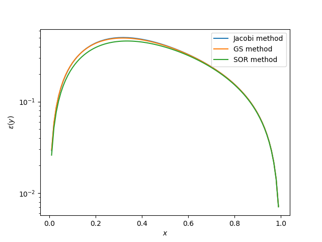
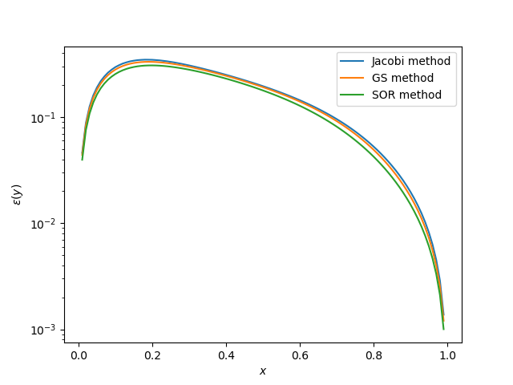
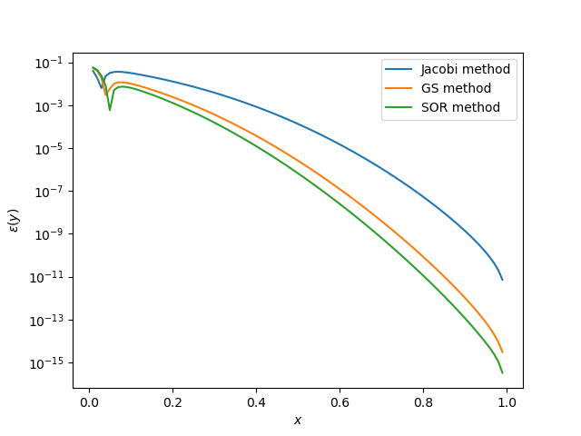
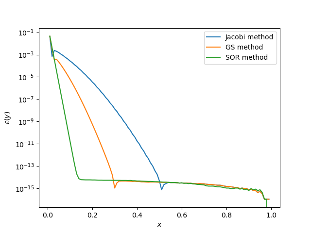

## 第四章：线性方程组的迭代解法

<center><span>计 93 王哲凡 2019011200</span></center>

### 上机题 2

> 2. 考虑常微分方程的两点边值问题：
>    $$
>    \begin{cases}
>    \varepsilon \dfrac{\mathrm{d}^2y}{\mathrm{d}x^2} + \dfrac{\mathrm{d}y}{\mathrm{d}x} = a, (0 < a < 1) \\
>    y(0) = 0, y(1) = 1
>    \end{cases}
>    $$
>    它的精确解为：
>    $$
>    y = \frac{1 - a}{1 - e^{-1 / \varepsilon}}\left(1 - e^{-\frac{x}{\varepsilon}} \right) + ax,
>    $$
>    为了把微分方程离散，把 $[0, 1]$ 区间 $n$ 等分，令 $h = \dfrac1n$：
>    $$
>    x_i = ih, (i = 1, 2, \cdots, n - 1),
>    $$
>    得到有限差分方程：
>    $$
>    \varepsilon \frac{y_{i - 1} - 2y_i + y_{i + 1}}{h^2} + \frac{y_{i + 1} - y_i}{h} = a,
>    $$
>    简化为：
>    $$
>    (\varepsilon + h) y_{i + 1} - (2 \varepsilon + h) y_i + \varepsilon y_{i -  1} = ah^2,
>    $$
>    从而离散后得到的线性方程组的系数矩阵与右端向量为：
>    $$
>    \mathbf{A} = 
>    \begin{bmatrix}
>    - (2 \varepsilon + h) & \varepsilon + h & & & \\
>    \varepsilon & - (2 \varepsilon + h) & \varepsilon + h & & \\
>    & \varepsilon & - (2 \varepsilon + h) & \ddots & \\
>    & & \ddots & \ddots & - \varepsilon + h \\
>    & & & \varepsilon & - (2 \varepsilon + h)
>    \end{bmatrix},
>    \mathbf{b} = 
>    \begin{bmatrix}
>    ah^2 \\
>    \vdots \\
>    ah^2 - \varepsilon - h
>    \end{bmatrix}.
>    $$
>
>    1. 对 $\varepsilon = 1, a = \dfrac12, n = 100$，分别用雅可比，G-S 和 SOR 方法求线性方程组的解，要求相邻迭代解的差的无穷范数不超过 $10^{-3}$ 时停止迭代，然后比较与精确解的误差。
>    2. 对 $\varepsilon = 0.1, \varepsilon = 0.01, \varepsilon = 0.001$ 考虑同样的问题。

#### 实验过程

##### 基本实现

首先实现矩阵 $\mathbf{A}$ 和向量 $\mathbf{b}$ 的获取：

```python
def get_Ab(epsilon):
    A = np.zeros((n - 1, n - 1))
    for i in range(n - 2):
        A[i][i + 1] = epsilon + h
    for i in range(n - 1):
        A[i][i] = -(2 * epsilon + h)
    for i in range(1, n - 1):
        A[i][i - 1] = epsilon

    b = np.ones((n - 1)) * a * h ** 2
    b[-1] -= epsilon + h
    return A, b
```

计算精确解函数：

```python
def y(x, epsilon):
    return (1 - a) / (1 - np.exp(-1 / epsilon)) * (1 - np.exp(-x / epsilon)) + a * x
```

三种迭代法：

```python
def Jacobi(A, b):
    n, n = A.shape
    x = np.ones(n)
    iter = 0
    while True:
        y = np.copy(x)
        iter += 1
        for i in range(n):
            x[i] = b[i]
            if i > 0:
                x[i] -= A[i][i - 1] * y[i - 1]
            if i < n - 1:
                x[i] -= A[i][i + 1] * y[i + 1]
            x[i] /= A[i][i]
        if np.linalg.norm(x - y, ord=np.inf) <= 1e-3:
            return x, iter

def GS(A, b):
    n, n = A.shape
    x = np.ones(n)
    iter = 0
    while True:
        y = np.copy(x)
        iter += 1
        for i in range(n):
            x[i] = b[i]
            if i > 0:
                x[i] -= A[i][i - 1] * x[i - 1]
            if i < n - 1:
                x[i] -= A[i][i + 1] * x[i + 1]
            x[i] /= A[i][i]
        if np.linalg.norm(x - y, ord=np.inf) <= 1e-3:
            return x, iter

def SOR(A, b, w):
    n, n = A.shape
    x = np.ones(n)
    iter = 0
    while True:
        y = np.copy(x)
        z = np.copy(x)
        iter += 1
        for i in range(n):
            z[i] = b[i]
            if i > 0:
                z[i] -= A[i][i - 1] * x[i - 1]
            if i < n - 1:
                z[i] -= A[i][i + 1] * x[i + 1]
            z[i] /= A[i][i]
            x[i] = (1 - w) * x[i] + w * z[i]
        if np.linalg.norm(x - y, ord=np.inf) <= 1e-3:
            return x, iter
```

##### 第 1 问

分别用三种迭代法执行得到结果：

```
Jacobi method take 443 iterations to convergence.
Jacobi method: inf norm = 0.5037336050711907, second norm = 3.3378435419954213
GS method take 216 iterations to convergence.
GS method: inf norm = 0.49685535113842977, second norm = 3.309787130544279
SOR method take 215 iterations to convergence.
SOR method: inf norm = 0.46121108627135643, second norm = 3.1038372063276682
```

可以看到迭代步骤依次减少，特别是 G-S 和 SOR 相比于 Jacobi 迭代法，只需要一半不到的迭代轮数。

而误差范数上也是依次减小的，但相差并不明显。

画出图像如下：



##### 第 2 问

类似的得到结果。

对于 $\varepsilon = 0.1$ 与 1 基本相似：

```
Jacobi method take 241 iterations to convergence.
Jacobi method: inf norm = 0.3481094551732218, second norm = 2.0944322717656583
GS method take 135 iterations to convergence.
GS method: inf norm = 0.3323882277968625, second norm = 2.018123448829409
SOR method take 135 iterations to convergence.
SOR method: inf norm = 0.30742543743638606, second norm = 1.8694432133747911
```



对于 $\varepsilon = 0.01$，三种迭代法的差距变小，并且误差更为接近：

```
Jacobi method take 268 iterations to convergence.
Jacobi method: inf norm = 0.039589114867955466, second norm = 0.12067003486748872
GS method take 194 iterations to convergence.
GS method: inf norm = 0.0537173272734649, second norm = 0.07601006379280341
SOR method take 171 iterations to convergence.
SOR method: inf norm = 0.05684632840243864, second norm = 0.07848811009608472
```



对于 $\varepsilon = 0.001$，三种迭代法的误差、速度都没有很大区别，均能较快收敛：

```
Jacobi method take 124 iterations to convergence.
Jacobi method: inf norm = 0.041459521665572985, second norm = 0.04163654838969874
GS method take 112 iterations to convergence.
GS method: inf norm = 0.043706530493078044, second norm = 0.04380789740715727
SOR method take 102 iterations to convergence.
SOR method: inf norm = 0.04539634439358042, second norm = 0.04558519016017602
```



可以看到随着 $\varepsilon$ 的减小，三种迭代法的收敛速度均有变快，整体误差也呈现下降趋势。

这是由于 $\varepsilon$ 越小，原微分方程的解就越趋向于一个线性函数，差分方法就能得到更精确的解；而其较大时，差分运算本身就会带来一定的误差，同时收敛也比较慢。

而 $\varepsilon$ 较小时，还发现误差在 $0$ 附近会特别陡峭，这是因为 $0$ 附近函数的斜率非常大，导致误差被放大。

#### 实验结论

通过这次实验，我实践了三种迭代法，对于三种方法的收敛速度和误差有了更深的理解，可以看到，在一般情况下，应该更多选取优化后的后两者而非 Jacobi 迭代法。

